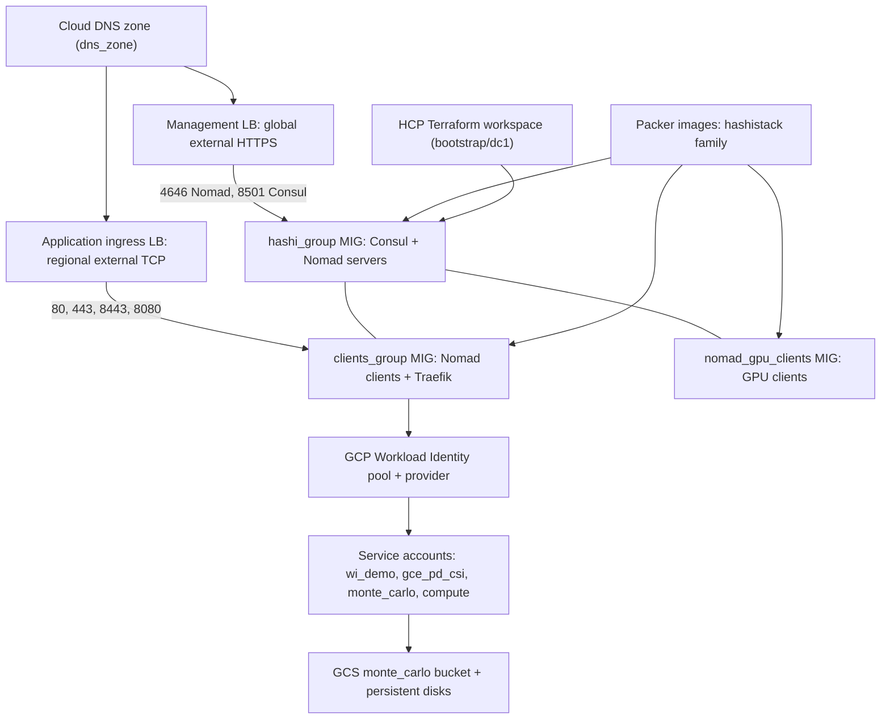

# Nomad Repositories

Workload orchestration implementations using HashiCorp Nomad.

---

## consul-nomad-gcp

Terraform, Packer and Task configuration that deploys resilient, multi-datacentre HashiCorp Consul and Nomad clusters on Google Cloud Platform, managed through HCP Terraform.

[:fontawesome-brands-github: View Repository](https://github.com/nhsy-hcp/consul-nomad-gcp){ .md-button }

<span class="badge badge-consul">Consul</span> <span class="badge badge-nomad">Nomad</span> <span class="badge badge-terraform">Terraform</span> <span class="badge badge-packer">Packer</span> <span class="badge badge-gcp">GCP</span>

### Overview

The repository provides Terraform, Packer and Task configuration for resilient, multi-datacentre Consul and Nomad clusters on Google Cloud Platform, managed through HCP Terraform. The README titles the project `terraform-gcp-consul-nomad`; it is a starting point for running containerised and non-containerised workloads.

### What it demonstrates

- Highly available Consul and Nomad server clusters on regional GCP Managed Instance Groups (MIGs) spread across zones, with stateful disks to preserve quorum during node replacement.
- Immutable infrastructure via Packer-built custom GCP images (`packer/gcp/consul_gcp.pkr.hcl` for servers, `client_gpu.pkr.hcl` for GPU-enabled clients) published to the `hashistack` image family.
- Nomad + Consul Workload Identity integration federated with GCP Workload Identity, so Nomad tasks assume GCP service accounts without long-lived keys (`task nomad:setup`).
- Consul Connect service mesh with mTLS, transparent proxy, and Consul Enterprise Admin Partitions for logical workload isolation.
- Example Nomad workloads in `jobs/`: Traefik ingress controller, `echoserver-connect`, `helloworld-connect`, `connect-test`, `jupyter`, GPU test jobs, and a Monte Carlo simulation job writing to GCS.
- GPU client MIGs using NVIDIA Tesla T4 instances with drivers pre-installed, plus optional preemptible VMs for cost reduction.
- Stateful workloads via the GCE Persistent Disk CSI driver, and Let's Encrypt (ACME) certificates for public endpoints.

### Architecture



The root Terraform configuration builds a custom VPC named `${var.cluster_name}-network` with a single regional subnet (default CIDR `10.2.0.0/16`, region default `europe-west1`). Firewall rules (`google_compute_firewall.internal` and `.default`) allow full TCP/UDP between instances tagged with the cluster name, which carries Consul gossip and Nomad RPC.

Compute is three sets of regional Managed Instance Groups built from instance templates that reference the Packer image family:

- `hashi_group` — unified Consul and Nomad server agents on the same VMs (default 3 server nodes, `n2-standard-2`), spread across zones with stateful disks.
- `clients_group` — standard Nomad clients (default 2, `n1-standard-4`, optional preemptible).
- `nomad_gpu_clients` — GPU Nomad clients (default 0), built from the GPU Packer template.

Two distinct load balancing paths front the cluster. The management load balancer is a global external managed HTTP(S) LB: a single `google_compute_global_address.nomad_consul` feeds two global forwarding rules and HTTPS target proxies (`consul`, `nomad`), each with its own URL map, health check, and backend service pointing at the server MIG. Traffic routes by port: `4646` to Nomad, `8501` to Consul. TLS is terminated with a `google_compute_ssl_certificate` populated from an `acme_certificate` issued by Let's Encrypt (with `acme_registration` and a `tls_private_key`). The application ingress load balancer is a regional external TCP LB (`google_compute_forwarding_rule.clients_lb` → `google_compute_region_backend_service.client_ingress` with `google_compute_region_health_check.client_ingress`) forwarding ports `80`, `443`, `8443`, and `8080` to the Nomad client MIGs, where Traefik runs as the ingress controller.

Cloud DNS (`google_dns_record_set` for `consul`, `nomad`, `ingress`, and an ingress CNAME) publishes the endpoints into an existing managed zone supplied as `dns_zone`. Internally, Consul provides DNS-based service discovery.

Identity flows as: Nomad issues OIDC workload identity tokens to tasks; a `google_iam_workload_identity_pool.nomad` plus `google_iam_workload_identity_pool_provider.nomad_provider` trust Nomad as an OIDC issuer; tasks then impersonate dedicated GCP service accounts (`wi_demo`, `gce_pd_csi`, `monte_carlo`, `compute`) through service account IAM bindings, reaching GCS (the `monte_carlo` bucket) and persistent disks without static keys. Gossip is encrypted with `random_bytes.consul_encrypt_key`; Consul and Nomad also speak TLS internally.

For the deployment control plane, the `bootstrap/dc1` configuration creates an HCP Terraform workspace with VCS integration to the GitHub repository, configures GCP Workload Identity for the workspace, and sets all workspace variables. The root module then runs inside that workspace via the `cloud {}` block in `backend.tf`. Packer builds images locally and a `task packer` run triggers the HCP Terraform run. The README notes the layout is structured for multi-datacentre deployments (e.g. `dc1`, `dc2`), each linked to its own HCP Terraform workspace and joined at the Consul/Nomad level.

The README contains no rendered diagram image; the diagram above is derived from its Architecture Overview and `docs/architecture.md`.

### Prerequisites

- HashiCorp Cloud Platform (HCP) account with an organization and project; HCP Terraform organization with API access. HCP Terraform workspaces are created automatically by the bootstrap process.
- GCP project with billing enabled, and a service account holding `roles/compute.admin`, `roles/dns.admin` (if using the DNS feature), `roles/iam.serviceAccountUser`, `roles/storage.admin` (for Packer image storage), and `roles/viewer`.
- Terraform v1.10+ (the embedded terraform-docs block states `>= 1.0.0` for the module itself).
- Packer.
- Task (taskfile.dev).
- Consul Enterprise and Nomad Enterprise licences (`consul_license`, `nomad_license`).
- An already existing GCP Cloud DNS zone (`dns_zone`) and an email address for Let's Encrypt registration.
- Authenticate to HCP Terraform with `terraform login`.
- Copy the example variable files: `bootstrap/dc1/terraform.tfvars.example`, `packer/gcp/consul_gcp.auto.pkrvars.hcl.example`, and `backend.tf.example`.

### Quickstart

```bash
# Authenticate with HCP Terraform
terraform login

# Create the required variable files from examples
cp bootstrap/dc1/terraform.tfvars.example bootstrap/dc1/terraform.tfvars
cp packer/gcp/consul_gcp.auto.pkrvars.hcl.example packer/gcp/consul_gcp.auto.pkrvars.hcl
cp backend.tf.example backend.tf

# Step 2: create the HCP Terraform workspace, GCP Workload Identity and variables
cd bootstrap/dc1
terraform init
terraform plan
terraform apply

# Step 5: initialise the root directory against the workspace backend
terraform init
terraform output

# Build the Packer image and trigger a run in the primary HCP Terraform workspace
task packer

# Apply the run in HCP Terraform, then configure the shell for the cluster
eval $(terraform output -raw eval_vars)
nomad status

# Open the Consul and Nomad UIs
task nomad:ui

# Enable Nomad + Consul Workload Identity integration
task nomad:setup
```

Before Step 2, edit `bootstrap/dc1/terraform.tfvars` (GCP project, GitHub org/repo, HCP Terraform org/project/workspace, and the `tfc_variables` map). Before `task packer`, edit `packer/gcp/consul_gcp.auto.pkrvars.hcl` (Consul/Nomad versions, image and image family, `gcp_project`, `sshuser`), and edit `backend.tf` with the HCP Terraform organization, workspace and project.

### Cleanup

The README provides no single teardown sequence; the following task targets are documented in its command table.

```bash
# Stop and purge all running Nomad jobs
task job:purge

# Destroy all managed instance groups via the gcloud CLI
task gcp:destroy:mig

# Destroy all load balancers and related resources via gcloud
task gcp:destroy:lb

# Destroy both MIGs and load balancers via the gcloud CLI
task gcp:destroy:all

# Delete the GCP images created by Packer
task clean
```

TODO: the README does not document destroying the HCP Terraform workspace or the `bootstrap/dc1` resources.

### Links

- Repository: [https://github.com/nhsy-hcp/consul-nomad-gcp](https://github.com/nhsy-hcp/consul-nomad-gcp)
- Architecture Deep Dive: [https://github.com/nhsy-hcp/consul-nomad-gcp/blob/main/docs/architecture.md](https://github.com/nhsy-hcp/consul-nomad-gcp/blob/main/docs/architecture.md)
- Task: [https://taskfile.dev/](https://taskfile.dev/) (installation: [https://taskfile.dev/installation/](https://taskfile.dev/installation/))
- Terraform downloads: [https://www.terraform.io/downloads.html](https://www.terraform.io/downloads.html)
- Packer downloads: [https://www.packer.io/downloads.html](https://www.packer.io/downloads.html)
