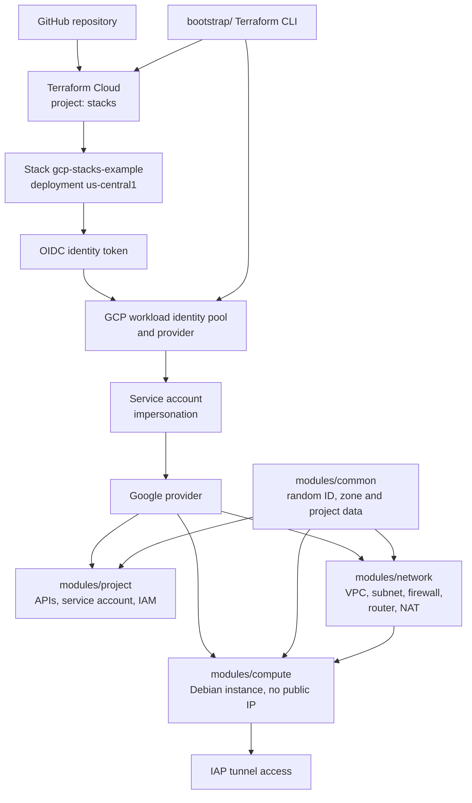
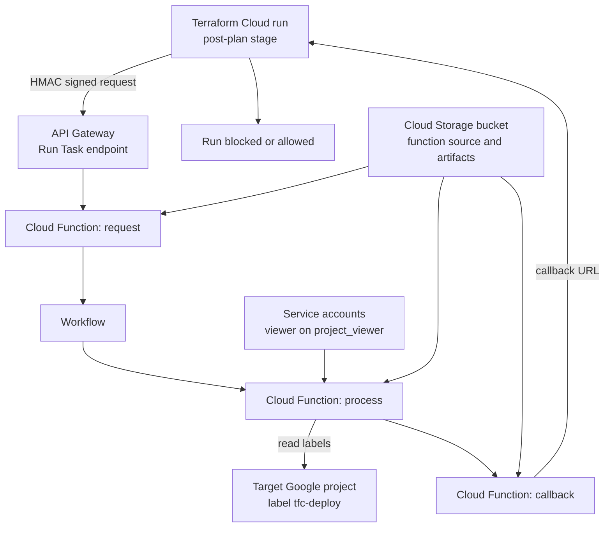

# Terraform Repositories

Infrastructure as code implementations using HashiCorp Terraform across multiple cloud platforms.

---

## gcp-stacks-example

Terraform Stacks deployment for Google Cloud that provisions a VPC network, firewall rules, a service account and a Compute Engine instance through a stack configuration run in Terraform Cloud.

[:fontawesome-brands-github: View Repository](https://github.com/nhsy-hcp/gcp-stacks-example){ .md-button }

<span class="badge badge-terraform">Terraform</span> <span class="badge badge-gcp">GCP</span>

### Overview

An example Terraform Stacks deployment targeting Google Cloud. It provisions a VPC network, firewall rules, a service account and a Compute Engine instance through a stack configuration run in Terraform Cloud.

### What it demonstrates

- A Terraform Stacks configuration composed of `components.tfcomponent.hcl`, `variables.tfcomponent.hcl`, `providers.tfcomponent.hcl` and `outputs.tfcomponent.hcl`.
- A `deployments.tfdeploy.hcl` deployment block (`us-central1`) that passes an `identity_token` into the stack for authentication.
- OIDC authentication to GCP from Terraform Cloud using Workload Identity Federation (a workload identity pool/provider audience and an impersonated service account email), avoiding static credentials.
- Reusable modules under `modules/`: `common` (random string IDs, GCP zone and project data), `compute` (Compute Engine instances on Debian images), `network` (VPC networks, subnets, firewall rules, cloud routers, NAT gateways), and `project` (API enablement, service accounts, IAM roles).
- A `bootstrap/` Terraform configuration that creates the Terraform Cloud workspace and the GCP project prerequisites.
- Private instance access over Identity-Aware Proxy (IAP) tunnelling rather than a public IP, surfaced through an `ssh_command` output.
- Stack teardown driven from configuration by setting `destroy = true` on the deployment.

### Architecture



Terraform Cloud hosts a project named `stacks` containing a stack named `gcp-stacks-example`, sourced from the GitHub repository. The stack's deployment file `deployments.tfdeploy.hcl` declares a single deployment, `us-central1`, whose inputs are an `identity_token.gcp.jwt`, an `audience` pointing at a GCP workload identity pool provider, a `project_id`, a `service_account_email` and a `region`. Terraform Cloud mints the OIDC token, GCP's workload identity pool exchanges it for impersonation of that service account, and the stack's Google provider is configured from those inputs.

The stack's components draw on four modules. `modules/project` enables the required GCP APIs and creates the service account and IAM role bindings. `modules/network` creates the VPC network, subnet, firewall rules, cloud router and NAT gateway. `modules/compute` creates the Compute Engine instance from a Debian image inside that network, with no public IP, reachable only through IAP tunnelling. `modules/common` supplies shared inputs: a random string identifier and lookups of available zones and project metadata.

Separately, the `bootstrap/` configuration is applied locally with the standard Terraform CLI and is what creates the Terraform Cloud workspace and the GCP project prerequisites, including the workload identity pool and provider referenced in `deployments.tfdeploy.hcl`.

### Prerequisites

- GitHub repository (fork of this repository).
- Google Cloud project with owner IAM permissions.
- Terraform Cloud organisation.
- terraform CLI — installable via `brew install hashicorp/tap/terraform` (see the [HashiCorp homebrew tap](https://github.com/hashicorp/homebrew-tap)).
- `gcloud` CLI, for the IAP SSH step.

TODO: the README does not state a minimum Terraform version (the repository contains a `.terraform-version` file that was not read).

### Quickstart

Install the terraform CLI:

```bash
brew install hashicorp/tap/terraform
```

Fork the repository to your own GitHub account, then add `bootstrap/terraform.tfvars` with the required values:

```hcl
tfc_organization_name = "org name"
gcp_project_id        = "project id"
```

Bootstrap the Terraform Cloud workspace and GCP project:

```bash
cd bootstrap
terraform init
terraform plan
terraform apply
```

Update `deployments.tfdeploy.hcl` with the `audience`, `project_id` and `service_account_email` values, then commit it to your GitHub repository:

```hcl
deployment "us-central1" {
  inputs = {
    identity_token        = identity_token.gcp.jwt
    audience              = "//iam.googleapis.com/projects/123456789/locations/global/workloadIdentityPools/wi-pool-gcp-stacks-example/providers/wi-provider-gcp-stacks-example"
    project_id            = "prj-123456789"
    service_account_email = "gcp-stacks-example@prj-123456789.iam.gserviceaccount.com"
    region                = "us-central1"
  }
}
```

Deployment is then driven from the Terraform Cloud UI: in the new `stacks` project, click `New` and select `Stack`; select the GitHub repository, name the stack `gcp-stacks-example` and click `Create Stack`; click `Fetch configuration` to load `deployments.tfdeploy.hcl`; open the `us-central1` deployment, open the latest plan (e.g. `Plan 1`) and click `Approve Plan`.

Once deployed, connect to the instance using the `ssh_command` output:

```bash
gcloud compute ssh <instance-name> --zone=<zone> --tunnel-through-iap
```

### Cleanup

Teardown is configuration-driven rather than a CLI command. Uncomment the `destroy = true` line in `deployments.tfdeploy.hcl`:

```hcl
deployment "us-central1" {
  inputs = {
    identity_token        = identity_token.gcp.jwt
    audience              = "//iam.googleapis.com/projects/123456789/locations/global/workloadIdentityPools/wi-pool-gcp-stacks-example/providers/wi-provider-gcp-stacks-example"
    project_id            = "prj-123456789"
    service_account_email = "gcp-stacks-example@prj-123456789.iam.gserviceaccount.com"
    region                = "us-central1"
  }
  destroy = true
}
```

Commit and push the changes to trigger a destroy plan in Terraform Cloud.

TODO: the README does not document destroying the `bootstrap/` resources.

### Links

- [Repository](https://github.com/nhsy-hcp/gcp-stacks-example)
- [HashiCorp homebrew tap](https://github.com/hashicorp/homebrew-tap)

---

## terraform-gcp-runtask-budgets

Terraform Cloud Run Task, implemented on serverless Google Cloud resources, that blocks Terraform deployments into a GCP project once its billing budget has been exceeded.

[:fontawesome-brands-github: View Repository](https://github.com/nhsy-hcp/terraform-gcp-runtask-budgets){ .md-button }

<span class="badge badge-terraform">Terraform</span> <span class="badge badge-gcp">GCP</span>

### Overview

A Terraform Cloud Run Task, implemented on serverless Google Cloud resources, that blocks Terraform deployments into a GCP project once its billing budget has been exceeded. Budget automation sets a `tfc-deploy` project label, and the Run Task evaluates that label during the post-plan stage of a Terraform run.

### What it demonstrates

- Post-plan Terraform Cloud Run Task integration, with Advisory or Mandatory enforcement, backed by an HMAC-signed endpoint.
- A serverless Run Task implementation on GCP: API Gateway fronting three Cloud Functions (request, process, callback) orchestrated by a Workflow.
- A budget-driven deployment gate — a `tfc-deploy` project label with value `true` or `false` is read from the target Google project and used to block or allow the run.
- Cross-project IAM: a `project_viewer` input grants the Cloud Function service account viewer access to the budgeted projects so it can read their labels.
- The broader Google Cloud Billing Budgets pattern using Pub/Sub and a Cloud Function to remove the billing account from a project (described in the README as an aggressive, non-production-only approach).
- Task-based automation (`task init`, `task plan`, `task apply`, `task all`, `task destroy`) replacing the previous Makefile.
- Local development and testing: pytest suites for the Cloud Functions in `cloud_functions/tests` and Terraform deploy/test/destroy pytests in `tests`.

### Architecture



The Terraform configuration in `terraform/` creates the following Google Cloud resources: an API Gateway, three Cloud Functions (`callback`, `process`, `request`), a Cloud Storage bucket, service accounts, and a Workflow.

Terraform Cloud reaches the Run Task endpoint published by API Gateway — the endpoint URL comes from the Terraform output `api_gateway_endpoint_uri`, and the HMAC key registered in Terraform Cloud must match the `hmac_key` Terraform input variable. API Gateway invokes the `request` Cloud Function, which accepts the Run Task request. A Workflow coordinates the asynchronous handling and invokes the `process` Cloud Function, which reads the target Google project's labels — specifically `tfc-deploy` — using the service account that has been granted the viewer role on the projects named in `project_viewer`. The `callback` Cloud Function returns the pass/fail verdict to Terraform Cloud's Run Task callback URL. When `tfc-deploy=false` and the workspace Run Task enforcement level is `mandatory`, the run is blocked. The Cloud Storage bucket is part of the deployed resource set, used for function source and artifacts.

For the Run Task to identify the target Google project correctly, the Google provider block in the evaluated configuration must set `project` explicitly or via an input variable (`project = "__GOOGLE_PROJECT_ID__"` or `project = var.project`).

The upstream pattern this builds on is Google's own budget alert flow: a Cloud Billing budget publishes threshold notifications to a Cloud Pub/Sub topic, a Cloud Function subscribes to that topic, and the function takes programmatic action on the project (in Google's example, detaching the billing account). The README also notes the constraint motivating the design: the Google Cloud Billing API cannot currently provide realtime cost details, so the label acts as the signal instead.

### Prerequisites

Run Task deployment only:

- Google Cloud SDK.
- Google Cloud project with owner permissions.
- Google Cloud credentials set up: `gcloud auth application-default login` and `gcloud auth login`.
- [Task](https://taskfile.dev/) task automation tool.
- Terraform v1.4+.
- Terraform Cloud account and workspace created.
- A Terraform sample deployment connected to the above workspace.

Additional prerequisites for Cloud Function development:

- Python 3.12+.
- A Python IDE, e.g. PyCharm.

### Quickstart

Create a file in the `terraform` folder named `terraform.tfvars`:

```hcl
project_id = "__DEPLOYMENT_GOOGLE_PROJECT__"
project_viewer = ["__BUDGET_GOOGLE_PROJECT__"]
```

`project_id` is the Google project id for deploying the TFC Run Task; `project_viewer` lists the Google project ids to assign the viewer IAM role to, allowing the Cloud Function service account to read project labels.

Navigate to the `terraform` folder in the terminal and run:

```bash
task init
task plan
task apply
```

or:

```bash
task all
```

Then configure [Terraform Cloud](https://app.terraform.io). Under `Settings/Run tasks` create a Run Task with the Endpoint URL set to the Terraform output `api_gateway_endpoint_uri` and an HMAC key matching the `hmac_key` Terraform input variable. In the workspace, under `Settings\Run Tasks`, add the Run Task with Run stage `Post-plan` and Enforcement level `Advisory` or `Mandatory`.

To test with a sample deployment:

```bash
terraform login
terraform init
terraform plan
terraform apply
```

Add the Terraform Cloud backend to the sample deployment using the instructions from the TFC workspace, and add the project label `tfc-deploy` with value `true` or `false` to the Google Cloud project. The run is blocked when `tfc-deploy=false` and the workspace Run Task enforcement level is `mandatory`.

### Cleanup

```bash
task destroy
```

All the resources deployed to the Google Cloud project are destroyed by this single command.

### Links

- [Repository](https://github.com/nhsy-hcp/terraform-gcp-runtask-budgets)
- [Google Cloud Billing Budgets](https://cloud.google.com/billing/docs/how-to/budgets)
- [Terraform Cloud](https://app.terraform.io)
- [Task](https://taskfile.dev/)
- Cloud function sources: `cloud_functions/runtask_callback`, `cloud_functions/runtask_process`, `cloud_functions/runtask_request`
- Tests: `cloud_functions/tests` (Cloud Function pytests), `tests` (Terraform pytests)
