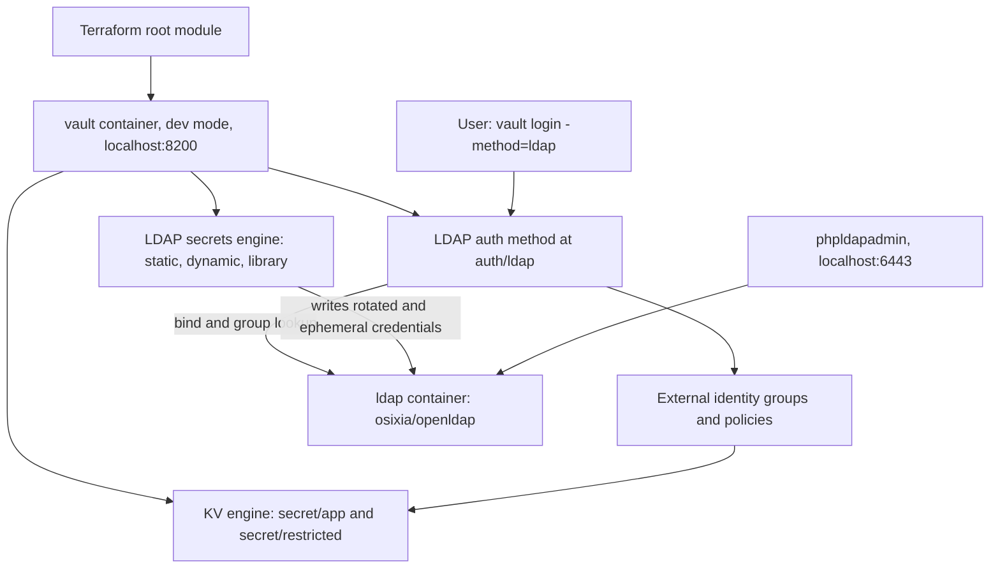
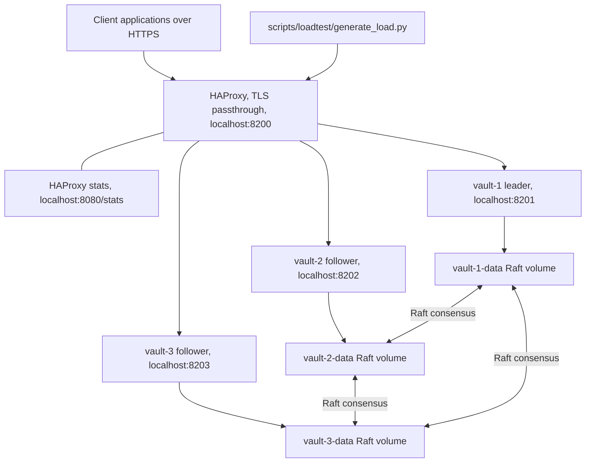
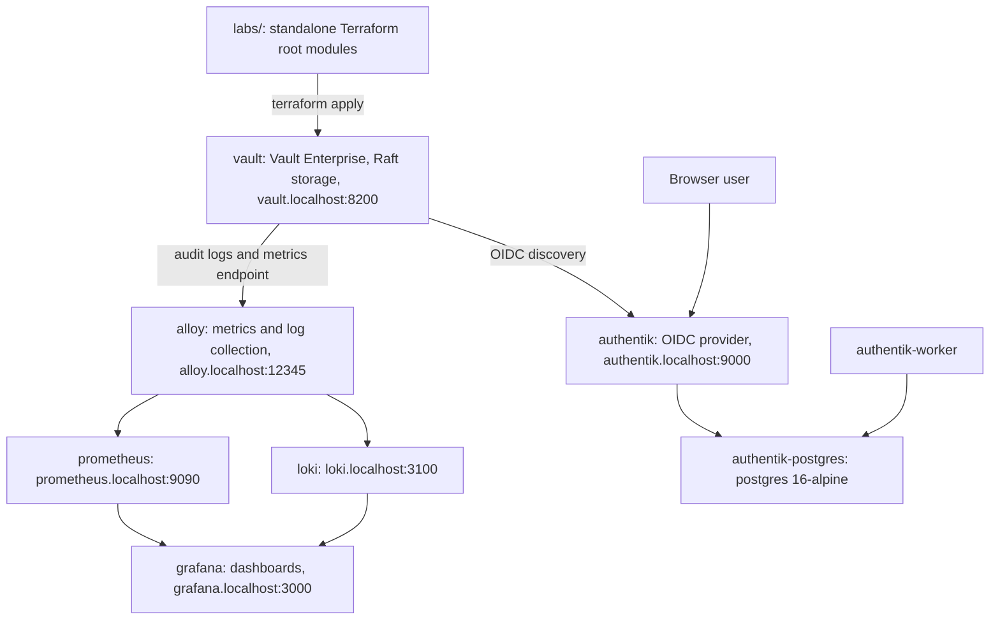
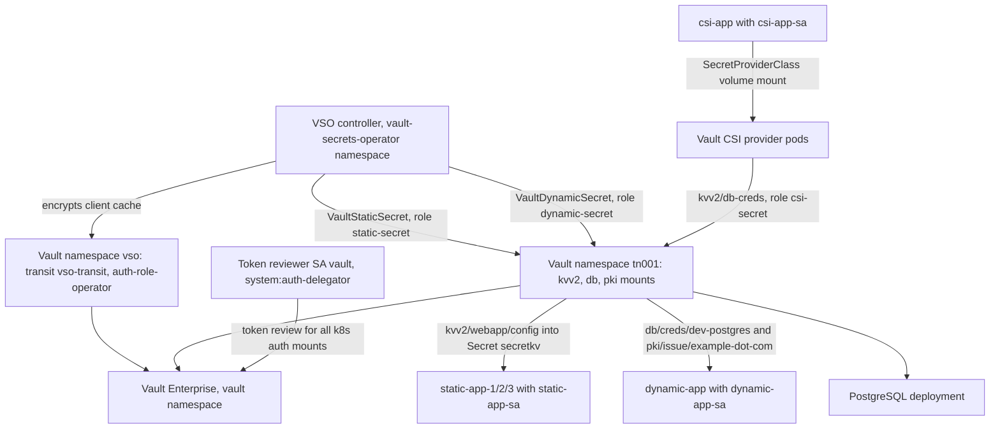
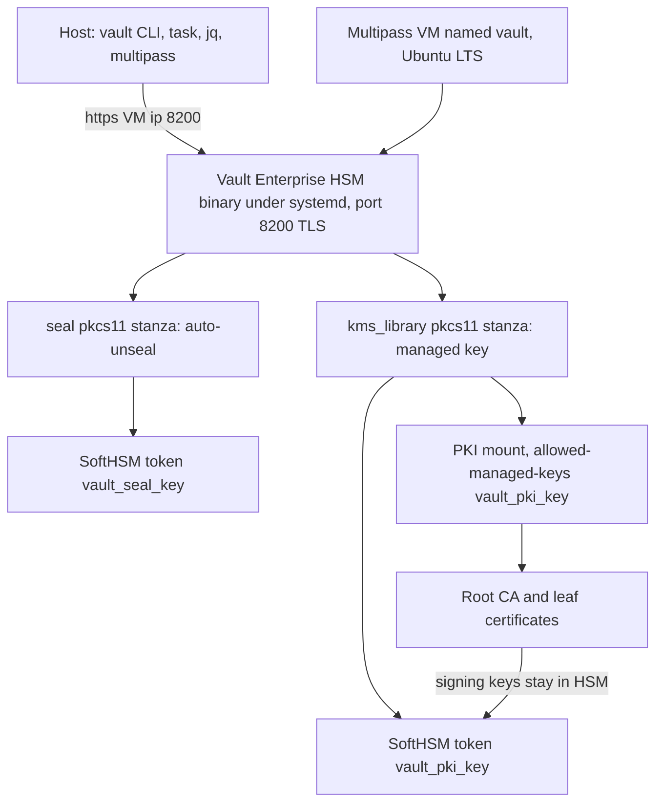
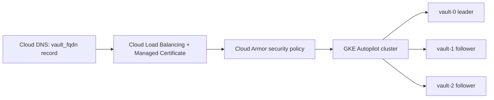
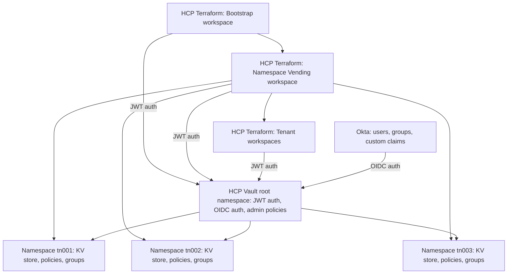
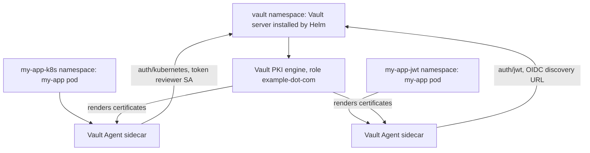
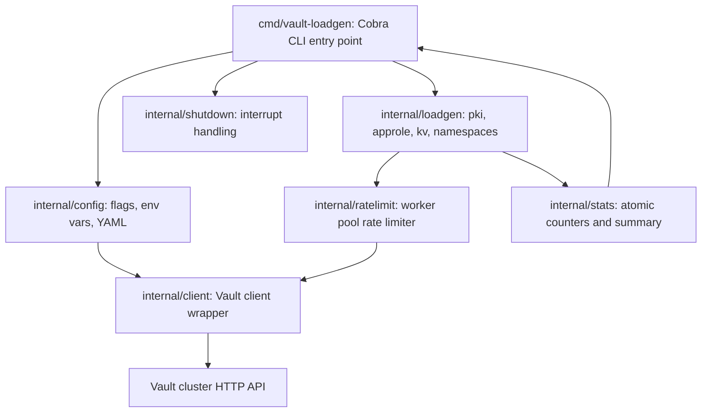
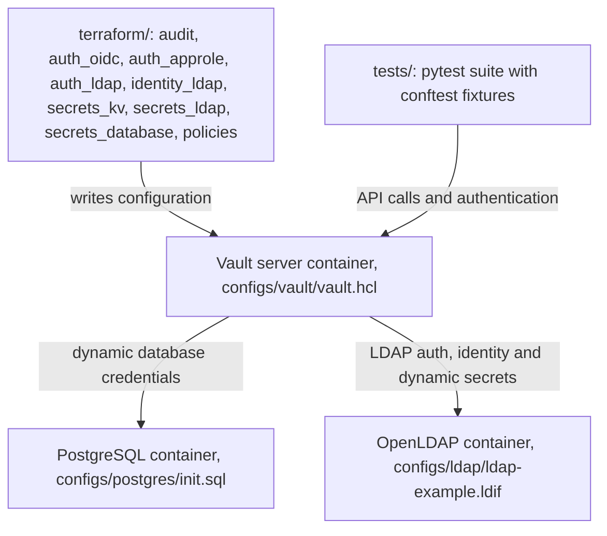

# Vault Repositories

Secrets management, encryption, and identity-based access implementations using HashiCorp Vault.

---

## docker-vault-ldap

Docker Compose lab demonstrating Vault LDAP authentication and the LDAP secrets engine against an OpenLDAP directory, with Vault configuration applied by Terraform.

[:fontawesome-brands-github: View Repository](https://github.com/nhsy-hcp/docker-vault-ldap){ .md-button }

<span class="badge badge-vault">Vault</span> <span class="badge badge-terraform">Terraform</span> <span class="badge badge-docker">Docker</span>

### Overview

A Docker Compose lab demonstrating HashiCorp Vault LDAP authentication and the LDAP secrets engine against an OpenLDAP directory. Vault configuration is applied with Terraform and orchestrated through a Taskfile.

### What it demonstrates

- LDAP authentication backend mounted at `/auth/ldap` against an OpenLDAP directory server.
- Identity entity mapping with group-based policy assignment via external identity groups (`vault-admins`, `developers`).
- KV secrets engine with tiered access control (`secret/app/*` vs `secret/restricted/*`).
- Sample users `bob` (vault-admins group) and `alice` (developers group) used to contrast policy outcomes.
- LDAP secrets engine static role for `alice` with automatic password rotation (`ldap/static-cred/alice`).
- LDAP secrets engine dynamic role creating ephemeral `developers` group members (`ldap/creds/developer`).
- LDAP secrets engine library set for check-out of the shared `app123` service account.
- Terraform native test framework suite (Terraform 1.6+) covering unit (plan-based) and integration (apply-based) validation.

### Architecture



Three containers are defined in `docker-compose.yml`: `vault` (image `hashicorp/vault:${VAULT_VERSION:-latest}`, development mode, exposed on `localhost:8200` with root token `root`), `ldap` (image `osixia/openldap:1.5.0`, holding sample users and groups under base DN `dc=example,dc=com`) and `phpldapadmin` (image `osixia/phpldapadmin:0.9.0`, a web LDAP administration UI on `https://localhost:6443` with bind DN `cn=admin,dc=example,dc=com` and password `admin`). All containers attach to the compose `default` network.

Terraform (root module `main.tf`, `versions.tf`) targets the Vault container over `http://localhost:8200` and configures the LDAP auth method pointed at the `ldap` container; the policies `vault-admins` (full access to secrets and Vault administration) and `app-secrets` (limited access to application secrets only); external identity groups aliased to the LDAP groups; the KV secrets engine with `secret/app/*` and `secret/restricted/*` paths; and the LDAP secrets engine with a static role, a dynamic role and a library set, all writing back into the OpenLDAP directory.

In the authentication flow a user logs in with `vault login -method=ldap -path=ldap`; Vault binds to OpenLDAP to verify credentials and read group membership; the LDAP group maps to a Vault external identity group which carries the policy; the resulting token's policy governs which KV paths are readable. For the LDAP secrets engine, Vault works in the reverse direction, writing rotated or ephemeral credentials into OpenLDAP. The README notes that an external group can have one, and only one, alias.

### Prerequisites

- Docker (with Docker Compose) running locally.
- `go-task` (Taskfile) and `jq` — `brew install go-task jq`.
- Terraform — `brew tap hashicorp/tap` then `brew install hashicorp/tap/terraform`; version 1.6.0+ required for the native testing framework.
- Vault CLI (used for the login and secrets-engine test commands).
- Free local ports 8200 and 6443.
- Environment variables `VAULT_ADDR=http://localhost:8200` and `VAULT_TOKEN=root`.

### Quickstart

```bash
git clone https://github.com/nhsy-hcp/docker-vault-ldap.git

# Launch the complete stack
task all

# Set environment variables
export VAULT_ADDR=http://localhost:8200
export VAULT_TOKEN=root
# Or use the helper script
./scripts/10_vault_vars.sh

# View service status
task status

# Display access URLs, admin credentials, and example commands
task output

# Fetch LDAP credentials
task cred:ldap-static
task cred:ldap-dynamic
task cred:ldap-library

# Test vault-admins group access (Bob)
LDAP_BOB=$(vault login -method=ldap -path=ldap -field=token username=bob password=password)
VAULT_TOKEN=$LDAP_BOB vault kv get secret/restricted/db
VAULT_TOKEN=$LDAP_BOB vault kv get secret/app/db

# Test developers group access (Alice)
LDAP_ALICE=$(vault login -method=ldap -path=ldap -field=token username=alice password=password)
VAULT_TOKEN=$LDAP_ALICE vault kv get secret/app/db
VAULT_TOKEN=$LDAP_ALICE vault kv get secret/restricted/db

# Read LDAP secrets engine credentials
vault read ldap/static-cred/alice
vault read ldap/creds/developer

# Run Terraform tests
terraform test
```

Access points: Vault UI at `http://localhost:8200/` (token `root`); phpLDAPadmin at `https://localhost:6443`.

### Cleanup

```bash
# Stop services
task stop

# Clean up and rebuild
task clean all

# View logs while troubleshooting
task logs
task logs-vault
```

### Links

- Repository: [https://github.com/nhsy-hcp/docker-vault-ldap](https://github.com/nhsy-hcp/docker-vault-ldap)
- Vault LDAP authentication documentation: [https://developer.hashicorp.com/vault/docs/auth/ldap](https://developer.hashicorp.com/vault/docs/auth/ldap)
- Vault Identity documentation: [https://developer.hashicorp.com/vault/docs/concepts/identity](https://developer.hashicorp.com/vault/docs/concepts/identity)
- CI workflow: [https://github.com/nhsy-hcp/docker-vault-ldap/actions/workflows/ci.yml](https://github.com/nhsy-hcp/docker-vault-ldap/actions/workflows/ci.yml)
- In-repo testing documentation: `tests/README.md`

---

## docker-vault-raft

Three-node Vault Enterprise cluster under Docker Compose using Raft integrated storage, end-to-end TLS from a self-signed CA, and an HAProxy load balancer in TLS passthrough mode.

[:fontawesome-brands-github: View Repository](https://github.com/nhsy-hcp/docker-vault-raft){ .md-button }

<span class="badge badge-vault">Vault</span> <span class="badge badge-docker">Docker</span>

### Overview

A three-node HashiCorp Vault Enterprise cluster running under Docker Compose with Raft integrated storage, end-to-end TLS using a self-signed CA, and an HAProxy load balancer in TLS passthrough mode. It includes a Python load-generation script for exercising the cluster. A Vault Enterprise licence is required.

### What it demonstrates

- 3-node Vault Enterprise cluster using Raft integrated storage and Raft consensus (leader election and replication).
- End-to-end TLS encryption with self-signed CA certificates, plus certificate verification and renewal tasks.
- HAProxy load balancing with TLS passthrough in front of the cluster, with a stats endpoint.
- Cluster initialisation, unsealing, status and Raft peer inspection via Taskfile targets.
- HA failover, TLS and cluster-formation test targets (`task test:tls`, `task test:cluster`, `task test:failover`).
- Load generation in three modes — PKI certificate leases, AppRole token leases, and KV v2 secrets — across many Vault namespaces with configurable parallel workers.

### Architecture



Client applications make HTTPS connections to an HAProxy load balancer on port 8200. HAProxy operates in TLS passthrough mode, so it forwards encrypted traffic without terminating TLS, and exposes a stats interface on port 8080 at `/stats`. HAProxy fans out to three Vault Enterprise containers — `vault-1` (leader), `vault-2` (follower) and `vault-3` (follower), all from image `hashicorp/vault-enterprise:${VAULT_VERSION:-1.20-ent}`. Each node runs a Vault process backed by its own Raft storage volume (`vault-1-data`, `vault-2-data`, `vault-3-data`), and the three Raft stores are peered with each other over the Raft consensus protocol for leader election and log replication. All containers sit on a dedicated `vault-network`.

Port mapping is: HAProxy `localhost:8200` to the Vault load balancer (TLS passthrough); HAProxy stats `localhost:8080` to `haproxy:8080` (HTTP); `localhost:8201` to `vault-1:8200`, `localhost:8202` to `vault-2:8200` and `localhost:8203` to `vault-3:8200` (all HTTPS).

Configuration is generated rather than checked in: `templates/` and `configs/` feed the `task config:certs` and `task config:raft` generators, which produce per-node certificates (`ca-cert`, `vault-1-cert`, `vault-2-cert`, `vault-3-cert` configs), per-node Vault config files and the HAProxy config. The HAProxy container uses image `haproxy:lts-alpine`. A `snapshots/` directory holds Raft snapshots and `benchmark/` holds benchmark material. The load generator at `scripts/loadtest/generate_load.py` talks to the cluster through the load balancer, creating child namespaces under a parent namespace (default `loadtest`) and generating PKI, AppRole or KV load in parallel worker threads.

### Prerequisites

- Docker — [https://www.docker.com/get-started](https://www.docker.com/get-started)
- Task — [https://taskfile.dev](https://taskfile.dev) (`brew install go-task` on macOS)
- Vault Enterprise license, set as `VAULT_LICENSE` in `.env` (copy from `.env.example`)
- Vault CLI (for `vault namespace create loadtest` and cluster interaction)
- Python 3 with the packages in `requirements.txt` (for load testing)

### Quickstart

```bash
# 1. Setup Environment
cp .env.example .env
# Edit .env and add your Vault license
# VAULT_LICENSE=your-license-here

# 2. Generate all certificates and configuration files
task config:all

# 3. Start all containers
task up

# 4. Initialize and Unseal Vault
task vault:init
task vault:unseal

# 5. Verify Cluster
task vault:status
task vault:raft

# Optional: load testing
vault namespace create loadtest
pip install -r requirements.txt
source .env
python3 scripts/loadtest/generate_load.py \
  --namespaces 10 \
  pki --leases-per-namespace 100

python3 scripts/loadtest/generate_load.py \
  --namespaces 10 \
  approles --approles-per-namespace 50

python3 scripts/loadtest/generate_load.py \
  --namespaces 10 \
  kv --engines-per-namespace 10 --secrets-per-engine 10

# Tests
task test:tls
task test:cluster
task test:failover
task test:all
```

Access points: Vault LB (leader) at `https://localhost:8200`; Vault nodes at `https://localhost:8201`, `:8202`, `:8203`; HAProxy stats at `http://localhost:8080/stats`.

### Cleanup

```bash
task down           # Stop cluster
task clean          # Remove containers and volumes

# Per-node data removal
task data:destroy -- vault-1
```

### Links

- Repository: [https://github.com/nhsy-hcp/docker-vault-raft](https://github.com/nhsy-hcp/docker-vault-raft)
- Docker: [https://www.docker.com/get-started](https://www.docker.com/get-started)
- Task: [https://taskfile.dev](https://taskfile.dev)
- Load testing scripts in repo: `scripts/loadtest`

---

## docker-vault-stack

Docker Compose stack bundling Vault Enterprise with Raft storage, audit logging and a Grafana, Prometheus, Loki and Alloy observability suite, alongside a `labs/` directory of Terraform-driven feature exercises.

[:fontawesome-brands-github: View Repository](https://github.com/nhsy-hcp/docker-vault-stack){ .md-button }

<span class="badge badge-vault">Vault</span> <span class="badge badge-terraform">Terraform</span> <span class="badge badge-docker">Docker</span> <span class="badge badge-aws">AWS</span> <span class="badge badge-azure">Azure</span>

### Overview

A Docker Compose stack for learning HashiCorp Vault Enterprise features, bundling Vault with Raft storage and audit logging alongside a Grafana/Prometheus/Loki/Alloy observability suite. A `labs/` directory holds self-contained Terraform-driven exercises for individual Vault features. A Vault Enterprise licence is required.

### What it demonstrates

Labs present in `labs/`, verified against the repository:

- **acl-templating** — ACL templating via two approaches: AppRole authentication with namespace-specific entity metadata templating (namespaces `bu01`, `bu02`, `bu03`), and Userpass authentication with identity groups and group-based templating.
- **audit-logs** — Audit log filtering, creating a standard file audit device (`vault_benchmark`) capturing all events alongside a filtered device (`vault_benchmark_filter`) scoped to the `vault-benchmark` namespace.
- **authentik** — Authentik as an OIDC provider for Vault, covering multi-namespace authentication, group-based access control and identity management, served at `authentik.localhost:9000`.
- **aws-secrets-sync** — Vault AWS Secrets Manager secret sync from a KV v2 mount `kv-sync` in namespace `admin/tn001`, with example secrets `app1_secrets` and `app2_secrets`.
- **entra-id** — Azure Entra ID (formerly Azure AD) OIDC integration, allowing Azure users and groups to authenticate to Vault.
- **pki** — PKI secrets engine with a self-signed root CA, two intermediate CAs (v1 and v2) and certificate management; private TLS keys are stored in Terraform state and the lab is explicitly not production-suitable.

Beyond the labs, the stack also covers Raft snapshot backup (`task backup`), Vault metrics scraping and dashboards, and `vault-benchmark` performance testing (`task benchmark`).

!!! note
    The repository README's lab list is out of date. It advertises `aws-auth`, `cert-auth`, `cross-namespace-secrets` and `namespaces` labs that do not exist in `labs/`, and omits the `audit-logs` and `aws-secrets-sync` labs that do. The verified list above reflects the contents of `labs/`.

### Architecture



Services defined in `docker-compose.yml` are `vault` (`hashicorp/vault-enterprise:${VAULT_VERSION:-2.0-ent}`, the main Vault server with a Raft storage backend and audit logging enabled, served over HTTP with TLS disabled at `http://vault.localhost:8200`), `prometheus` (`prom/prometheus:${PROMETHEUS_VERSION:-latest}`, scraping Vault's metrics endpoint and evaluating alerting rules), `loki` (`grafana/loki:${LOKI_VERSION:-latest}`, log aggregation), `alloy` (`grafana/alloy:${ALLOY_VERSION:-latest}`, the metrics and log collection agent), `grafana` (`grafana/grafana:${GRAFANA_VERSION:-latest}`, dashboards over the Prometheus and Loki datasources), `authentik-postgres` (`postgres:16-alpine`), `authentik` (`ghcr.io/goauthentik/server`, the OIDC identity provider used by the Authentik lab) and `authentik-worker` sharing the same image.

Configuration is injected via Docker configs (`vault-config`, `grafana-datasources`, `grafana-dashboards-config`, `prometheus-config`, `prometheus-rules`, `loki-config`, `alloy-config`) and persisted through named volumes (`vault-data`, `vault-logs`, `prometheus-data`, `loki-data`, `grafana-data`, `alloy-data`, plus the Authentik volumes). All services share the compose `default` network and are reachable by `*.localhost` aliases.

Vault writes audit logs and exposes a Prometheus metrics endpoint; Alloy collects Vault logs and metrics and ships them to Loki and Prometheus respectively; Grafana reads both as datasources for its dashboards. In the Authentik lab, the browser authenticates against Authentik, which acts as the OIDC provider that Vault's OIDC auth method trusts via discovery at `authentik.localhost:9000`.

Numbered shell scripts in `scripts/` drive the lifecycle: `00_vault_vars.sh`, `10_vault_init.sh`, `20_vault_unseal.sh` and `30_vault_config.sh`. The repo also contains `benchmark/` for vault-benchmark configuration and `tfc-agent/` at the top level. Each lab is a standalone Terraform root module executed against the running Vault instance.

### Prerequisites

- Docker and Docker Compose (`docker --version`, `docker compose version`).
- `go-task` and `jq` — `brew install go-task jq`.
- Vault CLI — `brew tap hashicorp/tap` then `brew install hashicorp/tap/vault`.
- Vault Enterprise license set as `VAULT_LICENSE` in `.env` (copy from `.env.example`).
- `VAULT_ADDR` pre-configured as `http://vault.localhost:8200`; `VAULT_TOKEN` is auto-populated by `task init` and must not be edited manually.
- `vault-benchmark` CLI for `task benchmark`.
- Terraform CLI for the labs; individual labs add their own requirements, for example the entra-id lab needs an Azure subscription with the Global Administrator role and Azure CLI access, and the aws-secrets-sync lab needs AWS credentials.

### Quickstart

```bash
git clone https://github.com/nhsy-hcp/docker-vault-stack.git
cd docker-vault-stack

# 1. Start the complete stack
task up

# 2. Initialize Vault (first time only)
task init

# 3. Unseal Vault
task unseal

# 4. Config Vault
task config

# 5. Load environment variables
source .env

# 6. Verify setup
vault status
vault token lookup
```

Daily usage after initial setup:

```bash
task up unseal
source .env
vault token lookup
```

Service URLs: Vault UI `http://vault.localhost:8200`, Authentik UI `http://authentik.localhost:9000` (when running the Authentik lab), Alloy `http://alloy.localhost:12345`, Grafana `http://grafana.localhost:3000`, Prometheus `http://prometheus.localhost:9090`, Loki `http://loki.localhost:3100`.

### Cleanup

```bash
task down     # Stop all services
task stop     # Stop services (alias for down)
task clean    # Remove containers and volumes completely

# Complete cleanup and restart
task clean
task up
task init
task unseal
task config
source .env
```

### Links

- Repository: [https://github.com/nhsy-hcp/docker-vault-stack](https://github.com/nhsy-hcp/docker-vault-stack)
- Authentik: [https://goauthentik.io/](https://goauthentik.io/)
- License: MIT (`LICENSE` in repo)
- Lab documentation lives in each `labs/<lab>/README.md`

---

## learn-vault-secrets-operator

Vault Secrets Operator lab for Kubernetes covering static KV, dynamic database and PKI secrets, and the Vault CSI driver, deployable to Minikube, Amazon EKS or Google GKE.

[:fontawesome-brands-github: View Repository](https://github.com/nhsy-hcp/learn-vault-secrets-operator){ .md-button }

<span class="badge badge-vault">Vault</span> <span class="badge badge-kubernetes">Kubernetes</span> <span class="badge badge-terraform">Terraform</span> <span class="badge badge-aws">AWS</span> <span class="badge badge-gcp">GCP</span>

### Overview

A lab demonstrating the HashiCorp Vault Secrets Operator (VSO) on Kubernetes, covering static KV secrets, dynamic database and PKI secrets, and the Vault CSI driver. Deployment is automated with Taskfile targets for Minikube, Amazon EKS and Google GKE, with Terraform provisioning the cloud clusters. A Vault Enterprise licence is required.

### What it demonstrates

- Static KV secrets synchronisation with `VaultStaticSecret` resources across multiple application namespaces.
- Dynamic database credentials from a PostgreSQL connection with automatic rotation on TTL.
- PKI certificate generation and management through `pki/issue/example-dot-com`.
- CSI driver integration for volume-mounted secrets with no Kubernetes `Secret` resource created.
- JWT authentication using a centralised Kubernetes token reviewer service account with per-application Vault roles.
- Encrypted VSO client cache backed by the Vault Transit engine (`vso-transit`).
- Automated deployment and teardown workflows across Minikube, EKS and GKE, with platform-specific storage class detection.

### Architecture



Vault Enterprise runs in the `vault` Kubernetes namespace alongside the Vault CSI provider pods; the VSO controller runs in the `vault-secrets-operator` namespace. Application namespaces are `static-app-1`, `static-app-2`, `static-app-3` (count configurable), `dynamic-app` and `csi-app`. A PostgreSQL deployment is included for the dynamic database secrets path.

Inside Vault there are two namespaces: `vso`, holding VSO configuration and transit encryption, and `tn001`, the tenant namespace holding application secrets. Mounts in `tn001` are `kvv2` (static secrets at `kvv2/webapp/config` and CSI secrets at `kvv2/db-creds`), `db` (dynamic credentials at `creds/dev-postgres`) and `pki` (role `example-dot-com`). The `vso` namespace holds the Transit engine `vso-transit` with key `vso-client-cache` and auth role `auth-role-operator`.

Authentication uses a centralised JWT token reviewer: service account `vault` in the `vault` namespace, bound by ClusterRoleBinding `vault-reviewer-binding` to the `system:auth-delegator` role, with a long-lived token stored in secret `vault-token-secret`. All Kubernetes auth mounts in both the `vso` and `tn001` Vault namespaces use this token for token review. Each application type then has its own Vault role, policy and service account: role `static-secret` / policy `static-secret` / service account `static-app-sa` (bound claims use the glob pattern `static-app-*` so multiple instances authorise against one role); role `dynamic-secret` / policy `dynamic-secret` / service account `dynamic-app-sa`; and role `csi-secret` / policy `csi-secret` / service account `csi-app-sa`.

Three secret flows connect these pieces. In the static flow, the VSO controller watches `VaultStaticSecret` resources; each `static-app-*` namespace's `static-app-sa` authenticates through a `VaultAuth` to Vault's `k8s-auth-mount` in `tn001` using the `static-secret` role; VSO reads `kvv2/webapp/config` and syncs it into a Kubernetes `Secret` named `secretkv` per namespace, consumed by the application pod as environment variables and as a `/secrets/static` volume mount. In the dynamic flow, the VSO controller watches `VaultDynamicSecret` resources; `dynamic-app-sa` authenticates the same way using the `dynamic-secret` role; VSO requests database credentials from `db/creds/dev-postgres` and certificates from `pki/issue/example-dot-com`, both syncing into Kubernetes `Secret` resources mounted at `/secrets/dynamic/db` and `/secrets/dynamic/tls` and rotating on TTL. In the CSI flow, the application pod declares a CSI volume with a `SecretProviderClass`; the CSI node driver intercepts the mount; `csi-app-sa` authenticates to `k8s-auth-mount` in `tn001` with the `csi-secret` role; and the Vault CSI Provider fetches `kvv2/db-creds` and mounts it straight onto the pod filesystem at `/secrets/static`, bypassing Kubernetes `Secret` objects entirely. Separately, the VSO controller authenticates into the Vault `vso` namespace and uses the Transit engine to encrypt its cached client data, reducing Vault API calls.

Storage classes are selected by inspecting the kubectl context during `install:vault`: contexts containing "minikube" use the `standard` class (minikube-hostpath); contexts containing "eks" or "arn:aws" get `gp2` set explicitly via `--set server.dataStorage.storageClass=gp2` (AWS EBS, via the EBS CSI driver); and contexts containing "gke" fall back to the cluster default, typically `standard-rwo`.

Repository layout: `Taskfile.yml` for automation, `vault-ent/` with `static-secrets/`, `dynamic-secrets/` and `csi/` manifest directories plus the required license file, `eks/` and `gke/` Terraform infrastructure, and `docs/` with platform and technical guides.

### Prerequisites

- Vault Enterprise license file placed at `vault-ent/vault-license.lic` — required for the Vault namespace and VSO CSI features; loaded automatically by `task config:vault`.
- kubectl
- helm
- minikube (for local development)
- jq
- task (taskfile.dev)
- AWS CLI (for EKS deployments)
- Google Cloud CLI (for GKE deployments)
- Terraform CLI
- A `.env` file holding `VAULT_TOKEN=<root-token>`, created and populated automatically by `task init:vault`; initialisation keys are written to `vault-init.json`.

### Quickstart

```bash
# Local Development with Minikube
task all

# Or run step-by-step:
task prerequisites
task minikube
task install
task secrets
task verify

# Amazon EKS Deployment
task prerequisites
task eks:all
task install
task secrets
task verify

# Google GKE Deployment
task prerequisites
task gke:all
task install
task secrets
task verify

# Verification
task verify:pods
task verify:static-secret
task verify:dynamic-secret
task verify:csi-secret

# Debugging
task status
task logs
task logs:vso
task port-forward
task ui
task list:k8s-auth
task events
```

### Cleanup

```bash
# Uninstall VSO and Vault
task uninstall

# Delete only application namespaces
task clean:namespaces

# Destroy Minikube cluster
task clean

# Destroy EKS cluster (automated)
task eks:destroy:auto

# Destroy GKE cluster (automated)
task gke:destroy:auto
```

### Links

- Repository: [https://github.com/nhsy-hcp/learn-vault-secrets-operator](https://github.com/nhsy-hcp/learn-vault-secrets-operator)
- Vault Secrets Operator documentation: [https://developer.hashicorp.com/vault/docs/platform/k8s/vso](https://developer.hashicorp.com/vault/docs/platform/k8s/vso)
- Vault Kubernetes auth method: [https://developer.hashicorp.com/vault/docs/auth/kubernetes](https://developer.hashicorp.com/vault/docs/auth/kubernetes)
- Vault CSI Provider: [https://developer.hashicorp.com/vault/docs/platform/k8s/csi](https://developer.hashicorp.com/vault/docs/platform/k8s/csi)
- HashiCorp Developer tutorials: [https://developer.hashicorp.com/vault/tutorials/kubernetes](https://developer.hashicorp.com/vault/tutorials/kubernetes)
- In-repo docs: `docs/aws-eks-deployment.md`, `docs/gke-deployment.md`, `docs/minikube-local-dev.md`, `docs/architecture.md`, `docs/troubleshooting.md`, `docs/testing-validation.md`, `docs/faq.md`

---

## multipass-vault-hsm

Taskfile automation that provisions Vault Enterprise with HSM support inside a Multipass virtual machine, using SoftHSM as the PKCS11 provider for auto-unseal and PKI managed keys.

[:fontawesome-brands-github: View Repository](https://github.com/nhsy-hcp/multipass-vault-hsm){ .md-button }

<span class="badge badge-vault">Vault</span>

### Overview

Scripts and Taskfile automation to provision a HashiCorp Vault Enterprise instance with HSM support inside a Multipass virtual machine, backed by SoftHSM as the PKCS#11 provider. It covers both PKCS#11 auto-unseal and PKCS#11 managed keys for the PKI secrets engine. A Vault Enterprise licence is required.

### What it demonstrates

- Provisioning an Ubuntu LTS Multipass VM and installing the Vault Enterprise HSM binary (`vault_<version>+ent.hsm_linux_arm64`) alongside `softhsm2`, `libsofthsm2` and `opensc`.
- Vault PKCS#11 auto-unseal using a SoftHSM token, configured as a `seal "pkcs11"` stanza with `key_label = "vault_seal_key"` and `hmac_key_label = "vault_seal_hmac_key"`.
- Inspecting SoftHSM slots and PKCS#11 module capabilities with `softhsm2-util --show-slots` and `pkcs11-tool`.
- Registering a second SoftHSM token as a Vault managed key (`sys/managed-keys/pkcs11/vault_pki_key`) through the `kms_library "pkcs11"` stanza.
- Mounting the PKI secrets engine restricted to that managed key (`-allowed-managed-keys=vault_pki_key`) and generating a root CA whose private key never leaves the HSM (`pki/root/generate/kms`).
- Issuing and inspecting leaf certificates from the HSM-backed CA, including `vault pki health-check pki`.

### Architecture



A single Multipass VM named `vault` (2 CPUs, 1 GB memory, 10 GB disk, Ubuntu LTS image) hosts the entire lab; the host machine runs only the Vault CLI, `task`, `jq` and `multipass`.

Inside the VM, `scripts/10_install.sh` adds the HashiCorp APT repository, installs `curl`, `htop`, `libsofthsm2`, `opensc`, `softhsm2`, `unzip`, `vault` and `vim`, then overwrites `/usr/bin/vault` with the Enterprise HSM build downloaded from `releases.hashicorp.com`. It enables the `vault` systemd unit, creates `/var/log/vault`, and adds the `vault` OS user to the `softhsm` group so it can reach the token store.

`scripts/20_post_install.sh` then initialises a SoftHSM token labelled `vault_seal_key` (SO PIN `4321`, PIN `1234`), records the resulting slot id in `/etc/vault.d/vault_seal_slot`, chowns `/var/lib/softhsm/tokens` to `vault`, installs the Enterprise license at `/etc/vault.d/vault.hclic` and points `license_path` at it. It appends two stanzas to `/etc/vault.d/vault.hcl`: a `seal "pkcs11"` block using `/usr/lib/softhsm/libsofthsm2.so` with the discovered slot, PIN `1234`, the seal key labels and `generate_key = "true"`; and a `kms_library "pkcs11"` block named `vault_pki_key` pointing at the same SoftHSM library. Vault is then started under systemd.

Vault listens on port 8200 over TLS on the VM's IPv4 address; the Taskfile derives `VAULT_ADDR` as `https://<multipass VM ip>:8200` and writes it, along with the root token from `vault_init.json`, into the host's `.env` (which also sets `VAULT_SKIP_VERIFY=true`). `scripts/30_vault_init.sh` initialises Vault and `scripts/40_vault_unseal.sh` handles unsealing; `scripts/00_vault_vars.sh` prints the Vault status and environment exports and copies the token to the clipboard on macOS.

For the managed-key portion of the lab, a second SoftHSM token labelled `vault_pki_key` is initialised manually inside the VM; Vault is restarted, and the CLI writes `sys/managed-keys/pkcs11/vault_pki_key` with that token's slot id, `mechanism=0x0001`, `key_bits=4096`, `allow_store_key=false`, `allow_generate_key=true` and `any_mount=true`. The PKI mount then generates its root CA key inside SoftHSM and signs leaf certificates through the HSM.

### Prerequisites

- go-task (`brew install go-task`).
- multipass.
- vault (CLI on the host).
- `jq` — used by the Taskfile to parse `multipass info` output and `vault_init.json`; not listed in the README prerequisites.
- A Vault Enterprise license file at the repository root named `vault.hclic` — the `launch` task has a precondition on it, and `.license.example` is provided as a template; the README does not document this requirement.
- A `.env` file at the repository root — also a `launch` precondition; `.env.example` provides `VAULT_ADDR`, `VAULT_TOKEN` and `VAULT_SKIP_VERIFY=true`.
- The install script downloads the `linux_arm64` Enterprise HSM build, so an arm64 host (Apple silicon) is assumed.

### Quickstart

```bash
# Setup: install dependencies and set up the environment
task all

# Set local environment variables
source .env

# Check Vault Status
vault status

# Lookup Vault Token
vault token lookup

# View SoftHSM Slots
multipass exec vault -- sudo -u vault softhsm2-util --show-slots

# View PKCS#11 Module Info
multipass exec vault -- sudo -u vault pkcs11-tool --module /usr/lib/softhsm/libsofthsm2.so --show-info -v
multipass exec vault -- sudo -u vault pkcs11-tool --module /usr/lib/softhsm/libsofthsm2.so -l -t

# Initialize PKI Key
multipass exec vault -- sudo -u vault softhsm2-util --init-token --free --label "vault_pki_key" --pin 1234 --so-pin 4321

# Restart Vault
task restart

# Show logs
task logs

# Configure Vault PKI Managed key
vault write sys/managed-keys/pkcs11/vault_pki_key  \
      library=vault_pki_key slot=754855359 pin=1234 \
      key_label=vault_pki_key \
      allow_store_key=false \
      allow_generate_key=true \
      mechanism=0x0001 key_bits=4096 \
      any_mount=true

vault secrets enable \
    -allowed-managed-keys=vault_pki_key \
    -default-lease-ttl=24h \
    pki

vault read /sys/mounts/pki

# Setup PKI Root CA and Roles
vault write -field=certificate pki/root/generate/kms \
    managed_key_name=vault_pki_key \
    common_name=root.example.com \
    ttl=8760h

vault write pki/config/urls \
    issuing_certificates="$VAULT_ADDR/v1/pki/ca" \
    crl_distribution_points="$VAULT_ADDR/v1/pki/crl"

vault write pki/roles/example-dot-com \
    allowed_domains=example.com \
    allow_subdomains=true \
    max_ttl=24h

# Issue client certificate
vault write pki/issue/example-dot-com \
    common_name=www.example.com \
    alt_names=app.example.com

# Useful PKI Commands
vault list pki/certs
multipass exec vault -- sudo -u vault softhsm2-util --show-slots
vault read -field=certificate /pki/cert/$(vault list -format=json pki/certs | jq -r '.[0]') | openssl x509 -text -noout
vault pki health-check pki
vault read /sys/managed-keys/pkcs11/vault_pki_key
vault read /sys/mounts/pki/tune
```

The `slot=754855359` value above is the example from the README; substitute the slot id reported by `softhsm2-util --show-slots` for the `vault_pki_key` token.

### Cleanup

```bash
task clean
```

This stops the Multipass VM and runs `multipass delete --purge vault`.

### Links

- Repository: [https://github.com/nhsy-hcp/multipass-vault-hsm](https://github.com/nhsy-hcp/multipass-vault-hsm)

TODO: the README references no external documentation links.

---

## terraform-gcp-vault-gke

Example Terraform deployment of a Vault cluster on GKE Autopilot, published to a public FQDN via Cloud Load Balancing and Cloud DNS and installed with the official Vault Helm chart.

[:fontawesome-brands-github: View Repository](https://github.com/nhsy-hcp/terraform-gcp-vault-gke){ .md-button }

<span class="badge badge-vault">Vault</span> <span class="badge badge-terraform">Terraform</span> <span class="badge badge-kubernetes">Kubernetes</span> <span class="badge badge-gcp">GCP</span>

### Overview

An example Terraform deployment of a HashiCorp Vault cluster on GKE Autopilot, published to a public FQDN via Cloud Load Balancing and Cloud DNS. Vault is installed with the official HashiCorp Vault Helm chart.

### What it demonstrates

- Provisioning a GKE Autopilot cluster with Terraform and deploying Vault onto it via the Vault Helm chart.
- Exposing Vault on a public HTTPS endpoint using a Cloud Load Balancer, a Google Managed Certificate and a Cloud DNS record in a delegated managed zone.
- Fronting the load balancer with a Cloud Armor security policy.
- Egress via Cloud NAT on a purpose-built Cloud Network.
- Automated Vault initialisation and Raft cluster formation across three pods (`vault-0`, `vault-1`, `vault-2`) using `task vault-init`.
- Deploying Vault Enterprise instead of Community edition by setting `vault_license`, `vault_repository` and `vault_version_tag` in `terraform.tfvars`.
- Operational tasks for observing the rollout: namespace events, pod logs and a `curl` health check against the Vault URL.

### Architecture



The diagram follows `docs/overview.png` in the repository, a left-to-right flow through five stages: Cloud DNS resolves the `vault_fqdn` record created in the delegated managed zone; Cloud Load Balancing with a Google Managed Certificate provides the HTTPS entry point, with the certificate validated and propagated after deployment (the README notes this can take up to 20 minutes); a Cloud Armor security policy is attached in front of the backend; GKE Autopilot hosts Vault; and the Vault cluster runs as three pods receiving traffic fanned out from GKE.

The README's resource list for the Terraform configuration is a GKE Autopilot cluster, a Cloud Armor security policy, a Cloud DNS record, a Cloud Load Balancer, Cloud NAT, a Cloud Network and the Vault Helm chart. The root module is split into `network.tf`, `gke.tf`, `dns.tf`, `vault.tf`, `common.tf` and `main.tf`, with supporting modules under `modules/` (`common`, `k8s`, `network`) and a `charts/` directory. After `task vault-init`, Raft reports `vault-0` as leader with `vault-1` and `vault-2` as followers over `vault-internal:8201`.

### Prerequisites

- A sandbox Google Cloud project with owner IAM permissions.
- A Google Cloud DNS managed zone with delegation to the sandbox project.
- curl
- git
- Google Cloud SDK + gke-gcloud-auth-plugin
- helm
- jq
- kubectl
- Makefile
- Terraform

The README notes that Google Cloud Shell ([https://shell.cloud.google.com/?show=terminal](https://shell.cloud.google.com/?show=terminal)) has the necessary tools preinstalled.

### Quickstart

```bash
gcloud config set project _project_id_
gcloud auth list

git clone https://github.com/nhsy-hcp/terraform-gcp-vault-gke.git
cd terraform-gcp-vault-gke
```

Create a file named `terraform.tfvars` with the following variables and set values accordingly:

```hcl
project = "my-vault-project"
region  = "europe-west1"
dns_managed_zone_name = "my-dns-zone"
vault_fqdn = "vault.example.com"
```

Add the HashiCorp helm repository and verify it is working, then deploy, initialise the cluster and monitor the rollout (each monitoring task in a separate terminal):

```bash
task helm-setup

task init
task gke
task vault

task vault-init

task vault-events
task vault-logs
task vault-curl

source ./scripts/50_vault_vars.sh
vault token lookup
```

### Cleanup

```bash
make destroy
```

### Links

- Repository: [https://github.com/nhsy-hcp/terraform-gcp-vault-gke](https://github.com/nhsy-hcp/terraform-gcp-vault-gke)
- Google Cloud Shell: [https://shell.cloud.google.com/?show=terminal](https://shell.cloud.google.com/?show=terminal)
- Architecture diagram: [https://github.com/nhsy-hcp/terraform-gcp-vault-gke/blob/main/docs/overview.png](https://github.com/nhsy-hcp/terraform-gcp-vault-gke/blob/main/docs/overview.png)

---

## terraform-vault-onboarding

Terraform configurations integrating HCP Vault with HCP Terraform, providing automated namespace provisioning, workspace management and authentication setup for multi-tenant Vault environments.

[:fontawesome-brands-github: View Repository](https://github.com/nhsy-hcp/terraform-vault-onboarding){ .md-button }

<span class="badge badge-vault">Vault</span> <span class="badge badge-terraform">Terraform</span> <span class="badge badge-aws">AWS</span>

### Overview

Terraform configurations that integrate HCP Vault with HCP Terraform, providing automated namespace provisioning, workspace management and authentication setup for multi-tenant Vault environments. The README states the project is for demonstration and learning only, not production use without security review and hardening.

### What it demonstrates

- A namespace vending pattern where HCP Vault namespaces and their matching HCP Terraform workspaces are centrally provisioned, while tenants manage their own resources inside their assigned namespace.
- JWT/OIDC authentication from HCP Terraform workspaces to HCP Vault, with bound claims scoping each workspace's Vault token to its namespace and policies.
- Okta OIDC authentication configured in the root HCP Vault namespace, issuing tokens based on group membership.
- Bootstrap of the underlying platform: an HCP HashiCorp Virtual Network (HVN), an HCP Vault cluster with randomised IDs, HCP Terraform projects and workspaces, and demo Okta users defined in the `okta_users` variable.
- Reusable modules for namespace creation (`modules/namespace`), workspace plus Vault integration (`modules/workspace`) and KV v2 secrets engines (`modules/kv-engine`).
- A four-policy model under `policies/`: `tfc_admin_policy.hcl`, `tfc_namespace_admin_policy.hcl`, `namespace_admin_policy.hcl` and `vault_admin_policy.hcl`.
- CI and local quality gates: `pre-commit`, `terraform fmt`, recursive `tflint`, `terraform validate`, and `act` for running the GitHub Actions workflow locally.

### Architecture



The solution design document (`docs/solution-design.md`) describes three planes. At the top, HCP Terraform holds three workspace types side by side — the Bootstrap workspace, the Namespace Vending workspace and Tenant workspaces — each authenticating downward into HCP Vault using JWT auth. In the middle, HCP Vault contains a root namespace holding the JWT auth backend (for HCP Terraform), the OIDC auth backend (for Okta) and admin policies, branching into three child tenant namespaces — `tn001`, `tn002`, `tn003` — each containing a KV store, policies and groups. At the bottom, Okta (users, groups, custom claims) authenticates into HCP Vault via OIDC auth.

Component relationships run as a chain: Bootstrap (root) creates the JWT auth backend, creates the HCP Terraform workspaces for `namespace-root` and `namespace-vending`, and configures the Okta OAuth app; Namespace Root then configures Okta OIDC auth and creates root-level policies; Namespace Vending then creates the child namespaces `tn001`/`tn002`/`tn003`, provisions an HCP Terraform workspace per tenant, and configures namespace-specific policies; and finally each tenant namespace adds its own resources such as KV engines and additional policies.

State dependencies are explicit: Bootstrap's JWT auth backend must exist before Namespace Root; Namespace Root's OIDC configuration must complete before Namespace Vending; namespaces must exist before the tenant configurations apply; and all components store remote state in the HCP Terraform backend. Bootstrap also provisions the HCP HVN (AWS region, default `eu-west-1`) and the HCP Vault cluster; all HCP resource IDs are suffixed with a random hex string for global uniqueness.

The repository is deliberately a monorepo for demonstration; the README recommends splitting `namespace-vending`, each tenant namespace and `modules/` into separate repositories for production.

### Prerequisites

- Terraform >= 1.14.0
- HCP account (HashiCorp Cloud Platform)
- HCP Vault (HCP Vault Cluster)
- HCP Terraform organization and API token
- Okta organization and API token (for OIDC authentication)
- Task ([https://taskfile.dev/](https://taskfile.dev/)) — optional, for automation
- Required `bootstrap/terraform.tfvars` values: `github_organization`, `github_repository`, `tfc_organization`, `tfc_project`, `tfc_token`, `hcp_project_id`, `okta_org_name`, `okta_api_token`. Optional with defaults: `hcp_hvn_id`, `hcp_vault_cluster_id`, `hcp_hvn_region`.

### Quickstart

The README gives only the variables step verbatim; the apply commands below are the `Taskfile.yml` targets the README's workflow section refers to.

```bash
cp ./bootstrap/terraform.tfvars.example ./bootstrap/terraform.tfvars
```

Then edit `./bootstrap/terraform.tfvars` and apply in dependency order — bootstrap, namespace root, namespace vending, then tenant namespaces:

```bash
task bootstrap:apply
```

`task bootstrap:apply` runs `terraform init`, `terraform apply -auto-approve` in `./bootstrap`, then `task update-env`. Supporting tasks:

```bash
task init
task validate
task lint
task test-ci
task vault:status
```

TODO: the README does not give explicit commands for applying `namespace-root/`, `namespace-vending/` or the tenant directories; it documents only the required apply order.

### Cleanup

```bash
task bootstrap:destroy
```

To destroy only the HCP Vault cluster resources (HVN, cluster, admin token):

```bash
task bootstrap:destroy-vault
```

TODO: the README does not document teardown commands for the namespace or tenant configurations; the design document only notes that rollback applies changes in reverse dependency order (Tenant, Vending, Root, Bootstrap).

### Links

- Repository: [https://github.com/nhsy-hcp/terraform-vault-onboarding](https://github.com/nhsy-hcp/terraform-vault-onboarding)
- Solution design documentation: [https://github.com/nhsy-hcp/terraform-vault-onboarding/blob/main/docs/solution-design.md](https://github.com/nhsy-hcp/terraform-vault-onboarding/blob/main/docs/solution-design.md)
- Task: [https://taskfile.dev/](https://taskfile.dev/)
- Vault provider documentation: [https://registry.terraform.io/providers/hashicorp/vault/latest/docs](https://registry.terraform.io/providers/hashicorp/vault/latest/docs)
- TFE provider documentation: [https://registry.terraform.io/providers/hashicorp/tfe/latest/docs](https://registry.terraform.io/providers/hashicorp/tfe/latest/docs)
- Okta provider documentation: [https://registry.terraform.io/providers/okta/okta/latest/docs](https://registry.terraform.io/providers/okta/okta/latest/docs)

---

## vault-k8s-jwt-migration

Demonstration of migrating Vault authentication from the Kubernetes auth method to the JWT auth method with OIDC discovery, deploying two parallel demo applications on minikube for direct comparison.

[:fontawesome-brands-github: View Repository](https://github.com/nhsy-hcp/vault-k8s-jwt-migration){ .md-button }

<span class="badge badge-vault">Vault</span> <span class="badge badge-kubernetes">Kubernetes</span>

### Overview

A demonstration project for migrating HashiCorp Vault authentication from the Kubernetes auth method to the JWT auth method using OIDC discovery. It deploys two parallel demo applications on minikube so the two approaches can be compared directly.

### What it demonstrates

- A Kubernetes auth app using the traditional `kubernetes` auth method backed by the TokenReview API.
- A JWT auth app using the `jwt` auth method with the Kubernetes OIDC discovery URL and JWKS verification.
- Vault Agent sidecars in both applications obtaining PKI certificates from Vault, so the credential path differs but the workload outcome is identical.
- The trade-offs between the two methods: long-lived service account token versus short-lived projected token, `system:auth-delegator` permissions versus no cluster permissions, unbound versus audience-bound tokens, and TokenReview API dependency versus cryptographic JWKS verification.
- A Vault PKI engine with a root CA for `example.com` and role `example-dot-com` issuing `*.example.com` certificates at a 1-hour TTL, governed by `pki-policy`.
- Certificate rotation via `task rotate:certs`, plus debugging tasks for logs, port-forwarding, the Vault UI and listing auth methods and roles.

### Architecture



A single Kubernetes cluster contains three namespaces. The `vault` namespace holds the Vault server pod, installed by Helm. Two application namespaces sit alongside it, `my-app-k8s` and `my-app-jwt`, each running a `my-app` pod composed of two containers: an App container and a Vault Agent sidecar.

Both Vault Agent sidecars connect back to the Vault server in the `vault` namespace, but over different auth paths: the agent in `my-app-k8s` uses Kubernetes auth (`auth/kubernetes`, configured with a token reviewer service account), and the agent in `my-app-jwt` uses JWT auth (`auth/jwt`, configured with the Kubernetes OIDC discovery URL). Both then render PKI certificates issued by the Vault PKI engine.

Supporting files live under `vault/`: `vault-values.yaml` (Helm values), `pki-policy.hcl` (Vault policy), `vault-k8s-*.yaml` (RBAC for Kubernetes auth), and per-app directories `vault/k8s-app/` and `vault/jwt-app/`, each with `deployment.yaml`, `configmap.yaml` and `service-account.yaml`. Orchestration is entirely in `Taskfile.yml`, with environment settings from `.env.example`.

### Prerequisites

- minikube — [https://minikube.sigs.k8s.io/docs/start/](https://minikube.sigs.k8s.io/docs/start/)
- kubectl — [https://kubernetes.io/docs/tasks/tools/](https://kubernetes.io/docs/tasks/tools/)
- Helm — [https://helm.sh/docs/intro/install/](https://helm.sh/docs/intro/install/)
- Task — [https://taskfile.dev/installation/](https://taskfile.dev/installation/)
- jq — [https://stedolan.github.io/jq/download/](https://stedolan.github.io/jq/download/)

`task prerequisites` checks for the required tools.

### Quickstart

```bash
# Run the complete demo
task all

# Or run steps individually:
task prerequisites  # Check required tools
task minikube       # Start minikube cluster
task install        # Install and initialize Vault
task config         # Configure auth methods and PKI
task deploy         # Deploy demo applications

# Check deployment status
task verify

# View certificates from both apps
task verify:certs

# Check Vault status
task status

# Demonstrate certificate rotation
task rotate:certs
```

### Cleanup

```bash
# Remove applications and Vault
task uninstall

# Remove minikube cluster entirely
task clean
```

### Links

- Repository: [https://github.com/nhsy-hcp/vault-k8s-jwt-migration](https://github.com/nhsy-hcp/vault-k8s-jwt-migration)
- minikube: [https://minikube.sigs.k8s.io/docs/start/](https://minikube.sigs.k8s.io/docs/start/)
- kubectl: [https://kubernetes.io/docs/tasks/tools/](https://kubernetes.io/docs/tasks/tools/)
- Helm: [https://helm.sh/docs/intro/install/](https://helm.sh/docs/intro/install/)
- Task: [https://taskfile.dev/installation/](https://taskfile.dev/installation/)
- jq: [https://stedolan.github.io/jq/download/](https://stedolan.github.io/jq/download/)

---

## vault-loadgen

Go command-line tool that generates synthetic load against Vault clusters to test performance, stability and scalability across PKI, AppRole and KV modes.

[:fontawesome-brands-github: View Repository](https://github.com/nhsy-hcp/vault-loadgen){ .md-button }

<span class="badge badge-vault">Vault</span>

### Overview

A Go command-line tool that generates synthetic load against HashiCorp Vault clusters to test performance, stability and scalability. It supports multiple secret engines, concurrent workers, and both Vault Enterprise (multi-namespace) and Vault Community (single-namespace) environments.

### What it demonstrates

- Three load modes as Cobra subcommands: `pki` (create large numbers of certificate leases), `approle` (generate AppRole credentials and perform logins to create token leases) and `kv` (populate KVv2 engines with large numbers of secrets).
- Concurrent load generation through a configurable worker pool, with an optional rate limiter (`--rate-limit`) in operations per second.
- Multi-namespace distribution on Vault Enterprise, including creating child namespaces under a `--parent-namespace`, and single-namespace (root) operation on Vault OSS with `--namespaces 0`.
- Idempotent setup operations that track Created / Skipped / Failed counts per resource type, so re-runs reuse existing infrastructure rather than erroring.
- Detailed run statistics: duration, total operations, operations per second, per-resource leases per second, and a success rate that counts skipped resources as successful.
- Layered configuration precedence: CLI flags and environment variables override a YAML configuration file.
- Graceful shutdown on interrupt (Ctrl+C), and text or JSON output (`--output`).

### Architecture



The tool follows the Golang Standards Project Layout. `cmd/vault-loadgen/` is the application entry point (main package) hosting the Cobra CLI, which dispatches to one of the three subcommands. Private code lives under `internal/`: `internal/client/` is a Vault client wrapper and helpers, the single point of contact with the Vault HTTP API; `internal/config/` is configuration management, merging CLI flags, environment variables and the YAML file; `internal/loadgen/` holds the load generation logic for PKI, AppRole and KV modes plus namespace management and validation; `internal/ratelimit/` is the rate limiting implementation applied to the worker pool; `internal/shutdown/` is graceful shutdown handling for interrupts; and `internal/stats/` is statistics tracking and reporting, using atomic operations for thread safety.

At runtime, the CLI resolves configuration, builds a Vault client from `VAULT_ADDR`/`VAULT_TOKEN` (or the `--vault-addr`/`--vault-token` flags), optionally creates child namespaces under the parent namespace, then fans work across the configured number of workers through the rate limiter into the selected mode's generator. Each worker's outcomes feed the stats collector, which prints the summary at the end. Tracked resource types are namespaces, auth methods (AppRole), PKI engines, KV engines, AppRole roles, certificate leases, token leases, secrets and authenticated reads.

### Prerequisites

- Go 1.21 or newer (to build from source).
- Task ([https://taskfile.dev/installation/](https://taskfile.dev/installation/)) — optional but recommended.
- A running HashiCorp Vault instance (for testing).
- A Vault token with sufficient permissions for the operations performed, supplied via `VAULT_ADDR`/`VAULT_TOKEN` environment variables (recommended) or `--vault-addr`/`--vault-token` flags.
- Vault Enterprise is required for the multi-namespace modes; Vault OSS works in single-namespace mode.

### Quickstart

Build from source:

```bash
git clone https://github.com/nhsy-hcp/vault-loadgen.git
cd vault-loadgen

task build
```

Or with `go build`:

```bash
go build -o ./bin/vault-loadgen ./cmd/vault-loadgen
```

Authenticate:

```bash
export VAULT_ADDR="http://127.0.0.1:8200"
export VAULT_TOKEN="your-vault-token"
```

Run a mode — PKI on Vault Enterprise, PKI on Vault OSS, AppRole, or KV:

```bash
./bin/vault-loadgen pki \
  --namespaces 10 \
  --pki-leases 1000 \
  --workers 8 \
  --pki-ttl 48h

./bin/vault-loadgen pki \
  --namespaces 0 \
  --pki-leases 500 \
  --workers 4

./bin/vault-loadgen approle \
  --namespaces 5 \
  --approle-logins 500 \
  --workers 8

./bin/vault-loadgen kv \
  --namespaces 5 \
  --kv-engines 10 \
  --secrets-per-engine 100 \
  --workers 16
```

Using a YAML configuration file, plus the local development environment and example runs:

```bash
./bin/vault-loadgen pki --config config.yml

task vault:up
task run:all
task run:pki
task run:approle
task run:kv
task run:all PARENT_NAMESPACE=loadtest
```

The README's clone command uses the placeholder URL `https://github.com/your-repo/vault-loadgen.git`; the real repository URL is used above.

### Cleanup

```bash
# Clean build artifacts
task clean

# Clean everything including dependencies
task clean:all

# Stop local Vault dev server
task vault:down

# Reset Vault dev server
task vault:reset
```

TODO: the README does not document commands for removing the namespaces, engines, roles, leases or secrets created inside Vault by a load run.

### Links

- Repository: [https://github.com/nhsy-hcp/vault-loadgen](https://github.com/nhsy-hcp/vault-loadgen)
- CI workflow: [https://github.com/nhsy-hcp/vault-loadgen/actions/workflows/ci.yml](https://github.com/nhsy-hcp/vault-loadgen/actions/workflows/ci.yml)
- Task installation: [https://taskfile.dev/installation/](https://taskfile.dev/installation/)
- GitHub Releases — the README uses the placeholder URL `https://github.com/your-repo/vault-loadgen/releases`

---

## vault-regression-testing

Regression testing framework for Vault that runs a Vault test environment in Docker, configures Vault resources with Terraform, and verifies the result with a Pytest suite.

[:fontawesome-brands-github: View Repository](https://github.com/nhsy-hcp/vault-regression-testing){ .md-button }

<span class="badge badge-vault">Vault</span> <span class="badge badge-terraform">Terraform</span> <span class="badge badge-docker">Docker</span>

### Overview

A regression testing framework for HashiCorp Vault that runs a Vault test environment in Docker, configures Vault resources with Terraform, and verifies the result with a Pytest suite. All steps are orchestrated through `Taskfile.yml`.

### What it demonstrates

- Fully automated Vault lifecycle handling: container startup, initialization, unsealing and token management.
- A Pytest regression suite covering health checks, KV secrets, AppRole authentication, PKI certificates, database dynamic secrets, LDAP integration, OIDC authentication, and security/operational/KV-metadata scenarios.
- Native OIDC authentication from GitHub Actions using Vault's JWT auth backend.
- An integrated OpenLDAP environment for testing LDAP authentication, identity group mapping and LDAP dynamic secrets.
- PostgreSQL integration with dynamic database credential generation and rotation testing, exercised through readonly and readwrite roles.
- A Vault version upgrade path (`task vault:upgrade`, driven by `VAULT_VERSION_UPGRADE` in `.env`) that re-runs the regression suite against the upgraded version.
- Python code quality gates with `flake8` and `black`, wired into `task lint` and a GitHub Actions regression-test workflow.

### Architecture



Three containers are started by `docker-compose.yml` via `task up`: a Vault server (configured by `configs/vault/vault.hcl`), a PostgreSQL database (initialised by `configs/postgres/init.sql`) and an OpenLDAP directory (seeded from `configs/ldap/ldap-example.ldif` by `task ldap:init`). `task init` initialises LDAP and Vault and unseals Vault, writing `.vault_init.json` with the generated keys.

Terraform, under `terraform/`, then configures Vault against that running instance. Its files map one-to-one onto Vault features: `main.tf` (provider and core setup), `variables.tf`, `audit.tf` (audit logging), `auth_oidc.tf` (OIDC for GitHub Actions), `auth_approle.tf`, `auth_ldap.tf`, `identity_ldap.tf` (identity and group mapping), `secrets_kv.tf`, `secrets_ldap.tf`, `secrets_database.tf` and `policies.tf`.

The Pytest suite under `tests/` then exercises the configured Vault over its API: `test_health.py`, `test_kv.py`, `test_approle.py`, `test_pki.py`, `test_database.py` (which reaches through Vault to PostgreSQL), `test_ldap.py` (which reaches through Vault to OpenLDAP), `test_oidc.py` and `test_enhanced.py`, with shared fixtures in `conftest.py`. Vault is therefore the hub: Terraform writes configuration into it, the tests read and authenticate against it, and Vault in turn brokers credentials to PostgreSQL and OpenLDAP. Environment variables come from `.env` (auto-sourced, created from `.env.example`), and Python dependencies from `requirements.txt` installed into a `uv`-managed virtualenv.

### Prerequisites

- Docker and Docker Compose
- Go Task
- jq
- Python 3.14+
- Terraform
- uv (Python package manager)

Verify with:

```bash
task prereqs
```

### Quickstart

Copy `.env.example` to `.env` and fill in any required values, then set up the environment and run the full regression pipeline:

```bash
task setup

task all
```

`task all` runs `prereqs`, `lint`, `up`, `init`, `terraform:apply` and `test`, and leaves the environment running for inspection. Individual tasks:

```bash
task prereqs
task clean
task setup
task lint
task up
task init
task ldap:init
task ldap:status
task postgres:status
task postgres:test
task vault:init
task vault:unseal
task vault:status
task vault:upgrade
task terraform:apply
task terraform:destroy
task test
task down
```

### Cleanup

```bash
task terraform:destroy
task down
task clean
```

`task down` stops the containers and removes networks; `task clean` cleans up temporary files and Docker resources while preserving `.venv`.

### Links

- Repository: [https://github.com/nhsy-hcp/vault-regression-testing](https://github.com/nhsy-hcp/vault-regression-testing)
- Solution guide: [https://github.com/nhsy-hcp/vault-regression-testing/blob/main/docs/solution-guide.md](https://github.com/nhsy-hcp/vault-regression-testing/blob/main/docs/solution-guide.md)
- Regression test workflow: [https://github.com/nhsy-hcp/vault-regression-testing/actions/workflows/regression-test.yml](https://github.com/nhsy-hcp/vault-regression-testing/actions/workflows/regression-test.yml)
